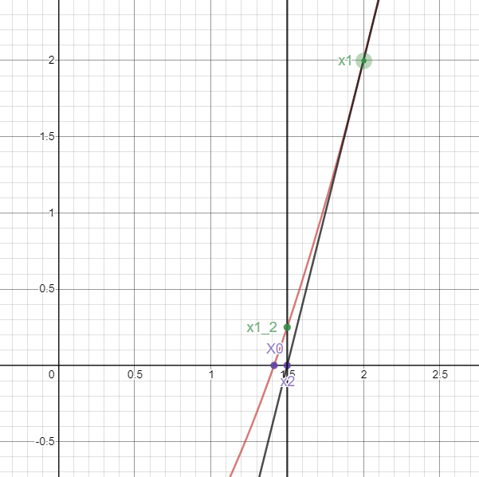
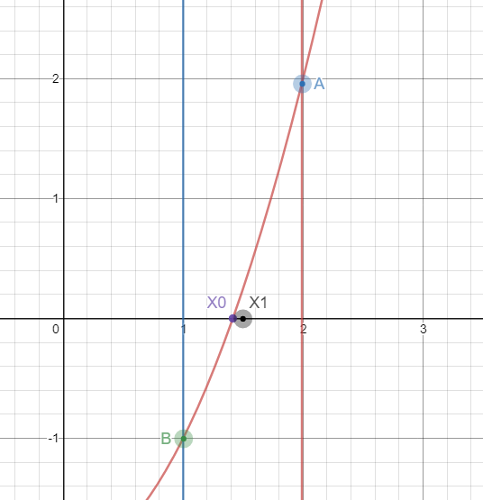

# LeetCode 69

[链接](https://leetcode-cn.com/problems/sqrtx)
>实现 int sqrt(int x) 函数。
>计算并返回 x 的平方根，其中 x 是非负整数。
>由于返回类型是整数，结果只保留整数的部分，小数部分将被舍去。


### 示例 1:

```html

   输入: 4   
   输出: 2
   说明: 8 的平方根是 2.82842...
 // 由于返回类型是整数，小数部分将被舍去。
```


##### 方案一：使用<b>牛顿迭代</b>来做.


><B>原理解释</b>  $f(x)=x^2-n$ 当$f(x)==0$ 的时候 $x==sqrt(n)$ 即函数图像与$x$轴焦点的横坐标$X0$为我们所求的值。那么我们要想办法得到这一个点，那么我们可以用牛顿迭代来求出无限接近这个点的横坐标。我们假设原函数图像上有一点 $x1$ 过这点做函数图像的切线，切线与 $x$轴的焦点到与$z1$相比肯定是更近于$X0$，所以我们大约取一个$x1$带入公式，得到一个更接近所求值的$x1$ 在带入公式，递归调用，一般调用100次或者$abs(x1-x0)< e^-{10}$。

```java 
	JAVA代码
	public static void main(String[] args)
	{
		System.out.println(mySqrt(4));
	}
	 public static  int mySqrt(int x) 
	 {
		 int num=0;
		 num=diedai(x, x, 0);
		 return num;
	 }
	 public static int diedai(int n,double x,int rank )
	 {
		 if(rank>100) return (int)x;
		 x=x-(Math.pow(x, 2)-n)/2.0/x;
		 System.out.println(x);
		return  diedai(n, x, ++rank);
		 
	 }
```

##### 方案二：使用二分求根

> 同样通过函数图像我们可以知道$f(x)=x^2 -n$ 当$f(x)==0$时 x为所求根。二分查找根
> 

```java
	public static void main(String[] args)
	{
		// TODO Auto-generated method stub
		System.out.println(mySqrt(4));
	}
	 public static  int mySqrt(int x) 
	 {
		 int num=0;
		 num=erfen(x,0,x,0);
		 return num;
	 }
	 public static int erfen(int n,double a,double b,int rank )
	 {
		 if(rank>100) return (int)(a+b)/2;
		 double mid=(a+b)/2;
		 if(mid*mid-n>0)
		 {
			 return erfen(n, a, mid, ++rank);
		 }
		 else if(mid*mid-n<0)
		 {
			 return  erfen(n, mid,b, ++rank);
			 
		 }
		 else {
			return (int)mid;
		}
		 
	 }
	 
```